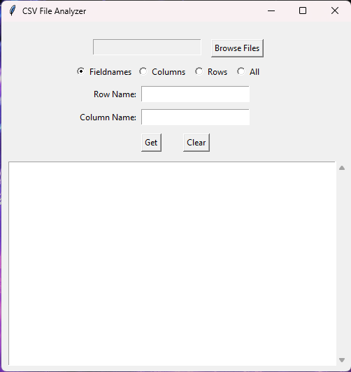

# CSVReader

### This application gives the user the ability to read and process CSV files easily.

---

****

#### **Figure 1: UI Screenshot.**

---

# Instructions:

**1: Download the latest release from the right side.**

**2: Click on the CSVReader.exe file.**

**3: To load a CSV file, click the "Browse Files" option and select a file.**

**4: To generate:**

- **Fieldnames:** Just press the "Get" button after selecting the "Fieldnames" option.
- **Columns:** Select the "Columns" option, enter a name for the Columns and press the "Get" button.
- **Rows:** Same as "Columns", but with "Rows".
- **All:** To generate everything from the file, select the "All" option and press the "Get" button.

**5: To clear the UI screen: press the "Clear" button.** 